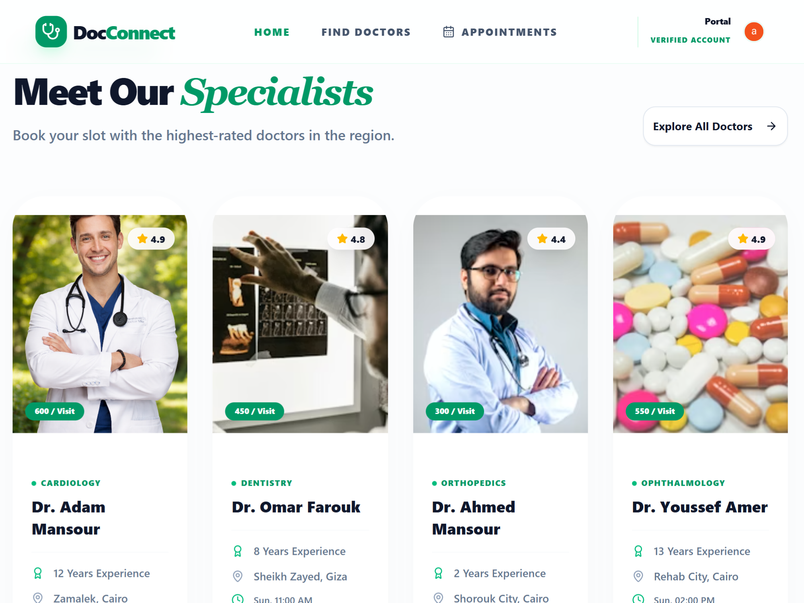
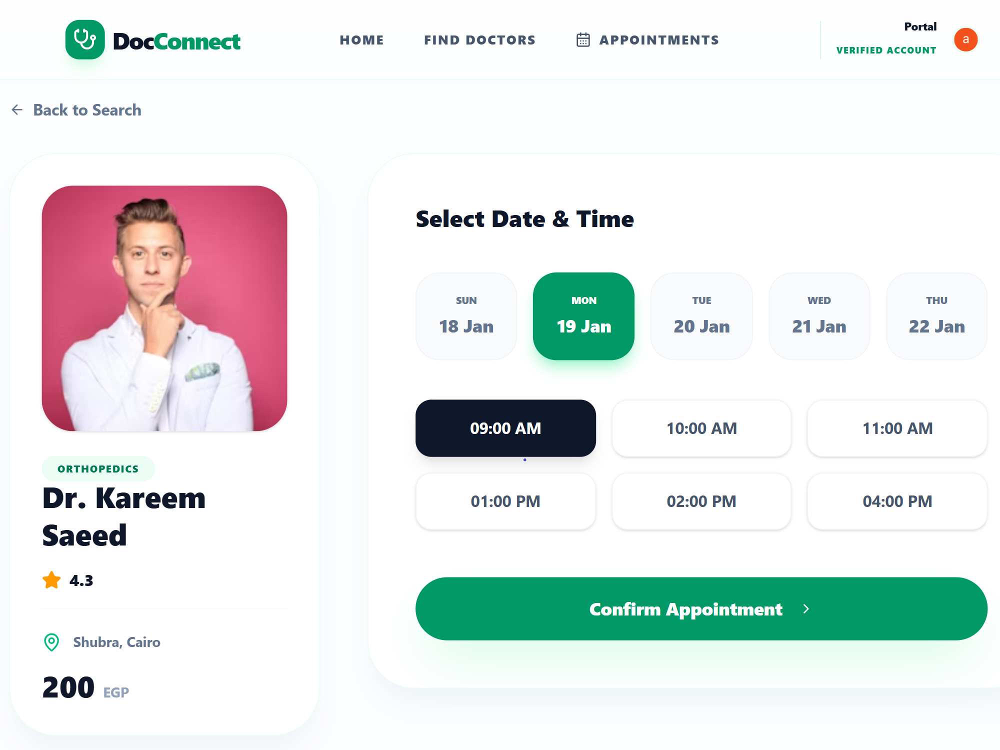
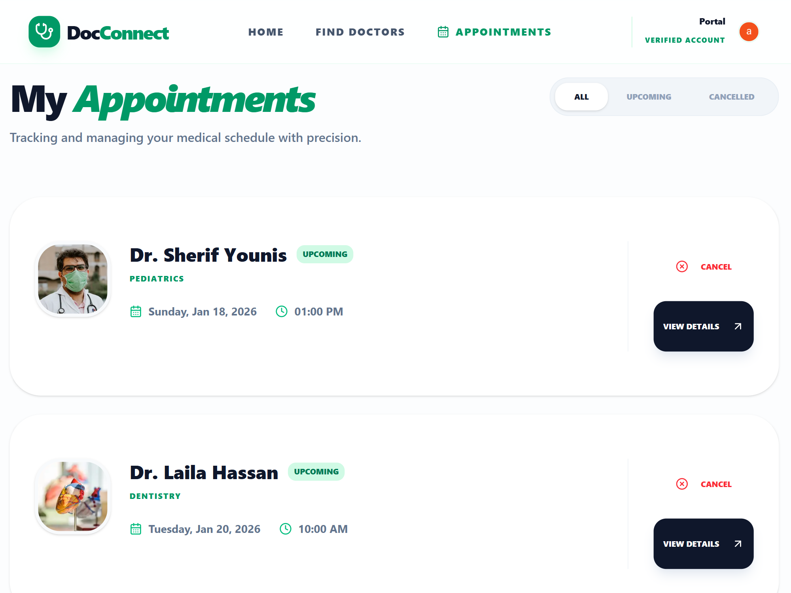
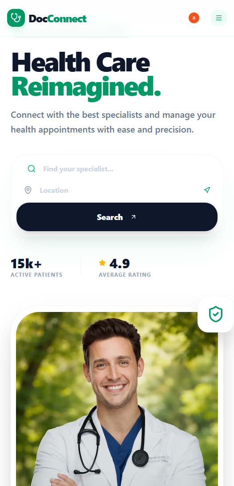

<!-- @format -->

# 🏥 MediCare – Healthcare Management Platform

[](medicare-platform-gamma.vercel.app)
[](https://nextjs.org/)
[](https://tailwindcss.com/)
[](https://opensource.org/licenses/MIT)

---

## 📌 Overview

**MediCare** is a modern, full‑stack healthcare appointment management platform designed to streamline the process of discovering doctors, booking medical appointments, and managing patient profiles. The project focuses on performance, scalability, and clean user experience using the latest web technologies.

---

## ✨ Key Features

- **👨‍⚕️ Doctor Discovery** – Browse and search doctors by specialty with detailed profiles.
- **📅 Smart Appointment Booking** – Real‑time scheduling with a smooth booking flow.
- **🔐 Secure Authentication** – User authentication and profile management powered by **Clerk**.
- **📱 Fully Responsive UI** – Optimized for mobile, tablet, and desktop devices.
- **⚡ High Performance & SEO** – Built with **Next.js 14 App Router** for speed and scalability.
- **🎨 Modern UI Components** – Clean and professional interface using **Shadcn UI**.

---

## 📸 Screenshots

### 🖥️ Desktop Experience

<p align="center">
  
</p>

| 👨‍⚕️ Specialist Selection                      | 📅 Appointment Booking                       |
| -------------------------------------------- | -------------------------------------------- |
|  |  |

| 📁 Appointments Management                             | 📱 Mobile Experience                       |
| ------------------------------------------------------ | ------------------------------------------ |
|  |  |

> 📁 Screenshots are stored in the `/screenshots` directory.

---

## 🛠️ Tech Stack

- **Framework:** Next.js 14 (App Router)
- **Library:** React.js
- **Language:** TypeScript
- **Styling:** Tailwind CSS
- **UI Components:** Shadcn UI
- **Authentication:** Clerk
- **Icons:** Lucide React

---

## 🎯 Project Purpose

This project was built to demonstrate a real‑world healthcare booking system using a modern full‑stack architecture. It highlights best practices in UI design, authentication, routing, and performance optimization.

---

## 📌 Project Status

- ✅ Fully functional demo
- 🚀 Production‑ready structure
- 🔧 Easily extendable with payments, notifications, and admin dashboards

---

## 🛣️ Roadmap

- [ ] Stripe payment integration
- [ ] Email & SMS notifications
- [ ] Admin analytics dashboard
- [ ] Multi‑language support

---

## 🚀 Getting Started

Follow these steps to run the project locally:

### 1. Clone the Repository

```bash
git clone https://github.com/YOUR_USERNAME/medicare-platform.git
cd medicare-platform
```

### 2. Install Dependencies

```bash
npm install
```

### 3. Configure Environment Variables

Create a `.env.local` file and add the required Clerk credentials:

```env
NEXT_PUBLIC_CLERK_PUBLISHABLE_KEY=your_key_here
CLERK_SECRET_KEY=your_secret_here
```

### 4. Run the Development Server

```bash
npm run dev
```

Open [http://localhost:3000](http://localhost:3000) to view the app in your browser.

---

## 📄 License

This project is licensed under the **MIT License**.

---

## 👤 Author
Developed by **Mohamed Gamal**  
Front-End / Full-Stack Developer specializing in modern web applications.
## 👤 Author

- 🐙 **GitHub:** [Mohamed Gamal](https://github.com/Mohamed-Gamal-code)
- 🔗 LinkedIn: [Connect](https://www.linkedin.com/in/mohamed-gamal-3965663a3)
- 🌐 Portfolio: [Visit](https://my-portfolio-3y8d.vercel.app)
- 💼 Upwork: [Hire Me](https://www.upwork.com/freelancers/~0194a7d28b23a1525f)  
